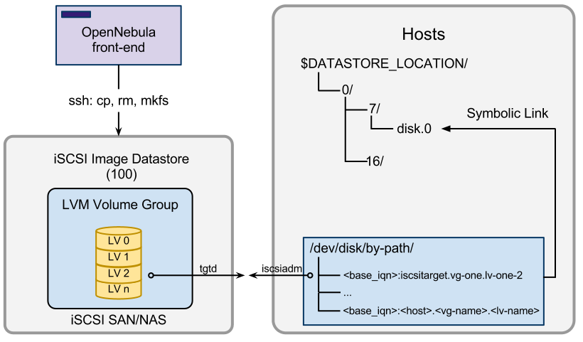

# Introduction

The iSCSI datastore driver provides OpenNebula with the possibility of using block-devices for VM images instead of the default file form. The use of the iSCSI datastores presents several benefits, especially regarding performance.

It is developed to work with `tgtd`, the Linux SCSI target framework. However this driver is written in a way it can be easily hacked into working with specific SAN systems or other iSCSI target softwares.

There are some limitations that you have to consider, though:

* No iSCSI ACLs. This driver doesn't implement ACLs or zoning for the targets defined in the server. This means that every host will be able to see through discovery all the targets exported by the iSCSI target server, as long as it can make a connection to the host on the iscsi port.

# Authors

* OpenNebula Team
* C12G Labs

# Compatibility

This add-on is compatible with OpenNebula 4.2.

# Features

# Requirements

## OpenNebula Front-end

Password-less ssh access to the iSCSI target as the oneadmin user from the frontend.

## The iSCSI Target

Manual installation of the supplied `tgt-setup-lun-one` script. This script will be installed under the share directory of OpenNebula (`/usr/share/one` or `/usr/share/opennebula` depending on the distribution). This script script should be installed in the iSCSI target somewhere in the `PATH`, e.g. `/usr/sbin/tgt-setup-lun-one` and it should belong to root.
Password-less sudo permission for: `tgtadm`, `tgt-setup-lun-one`, `lvcreate`, `lvremove` and `dd`.
LVM2 Linux SCSI target framework (tgt).

# Installation

To install the driver you have to copy these files:

* `tm` -> `/var/lib/one/remotes/tm/iscsi`
* `datastore` -> `/var/lib/one/remotes/datastore/iscsi`
* `bin/tgt-setup-lun-one` -> `/usr/sbin/tgt-setup-lun-one`

# Configuration

## Configuring the System Datastore

To use iSCSI drivers, you must configure the system datastore as shared. This sytem datastore will hold only the symbolic links to the block devices, so it will not take much space. See more details on the [System Datastore Guide](http://opennebula.org/documentation:rel4.4:system_ds).

It will also be used to hold context images and Disks created on the fly, they will be created as regular files.

## Configuring iSCSI Datastores

The first step to create a iSCSI datastore is to set up a template file for it. In the following table you can see the supported configuration attributes. The datastore type is set by its drivers, in this case be sure to add `DS_MAD=iscsi` and `TM_MAD=iscsi` for the transfer mechanism, see below.

* **NAME**: The name of the datastore
* **DS_MAD**: The DS type, use iscsi for the iSCSI datastore
* **TM_MAD**: Transfer drivers for the datastore, use iscsi, see below
* **DISK_TYPE**: Type for the VM disks using images from this datastore. Supported values are: block, file
* **BRIDGE_LIST**: The tgt server host. Defaults to localhost
* **VG_NAME**: The LVM volume group name. Defaults to vg-one
* **BASE_IQN**: The base IQN for iSCSI target. Defaults to iqn.2012-02.org.opennebula
* **RESTRICTED_DIRS**: Paths that can not be used to register images. A space separated list of paths. (1)
* **SAFE_DIRS**: If you need to un-block a directory under one of the RESTRICTED_DIRS. A space separated list of paths.
* **NO_DECOMPRESS**: Do not try to untar or decompress the file to be registered. Useful for specialized Transfer Managers
* **LIMIT_TRANSFER_BW**: Specify the maximum transfer rate in bytes/second when downloading images from a http/https URL. Suffixes K, M or G can be used.
* **DATASTORE_CAPACITY_CHECK**: If “yes”, the available capacity of the datastore is checked before creating a new image

> (1) This will prevent users registering important files as VM images and accessing them through their VMs. OpenNebula will automatically add its configuration directories: /var/lib/one, /etc/one and oneadmin's home. If users try to register an image from a restricted directory, they will get the following error message: “Not allowed to copy image file”.

For example, the following examples illustrates the creation of a iSCSI datastore using a configuration file. In this case we will use the host iscsitarget as our iSCSI target server.

~~~~
> cat ds.conf
NAME = production
DS_MAD = iscsi
TM_MAD = iscsi
VG_NAME = vg-one
HOST = iscsitarget

> onedatastore create ds.conf
ID: 100

> onedatastore list
  ID NAME            CLUSTER  IMAGES TYPE   TM    
   0 system          none     0      fs     shared
   1 default         none     3      fs     shared
 100 production      none     0      iscsi  shared
~~~~

The DS and TM MAD can be changed later using the onedatastore update command. You can check more details of the datastore by issuing the onedatastore show command.

> Note that datastores are not associated to any cluster by default, and they are supposed to be accessible by every single host. If you need to configure datastores for just a subset of the hosts take a look to the [Cluster guide](http://opennebula.org/documentation:rel4.4:cluster_guide).

## Configuring Default Values

The default values can be modified in `/var/lib/one/remotes/datastore/iscsi/iscsi.conf`:

* **HOST**: Default iSCSI target host. Default: `localhost`
* **BASE_IQN**: Default IQN path. Default: `iqn.2012-02.org.opennebula`
* **VG_NAME**: Default volume group. Default: `vg-one`
* **NO_ISCSI**: Lists of hosts (separated by spaces) for which no iscsiadm login or logout is performed. Default: `$HOSTNAME`
* **TARGET_CONF**: File where the iSCSI configured is dumped to (`tgt-admin –dump`). If it poings to `/dev/null`, iSCSI targets will not be persistent. Default: `/etc/tgt/targets.conf`

# Usage 

The iSCSI transfer driver will issue a iSCSI discover command in the target server with iscsiadm. Once the block device is available in the host, the driver will login, mount it and link it to disk.i.

## Host Configuration

The hosts must have [Open-iSCSI](http://www.open-iscsi.org/) installed, which provides `iscsiadm`.

In order for `iscsiadm` to work, it needs to be able to make a connection on the default iSCSI port (3260) with the iSCSI target server. Firewalls should be adjusted to allow this connection to take place.

The `oneadmin` user must have sudo permissions to execute `iscsiadm`.

# Tuning & Extending

System administrators and integrators are encouraged to modify these drivers in order to integrate them with their iSCSI SAN/NAS solution. To do so, the following is a list of files that may be adapted:

Under `/var/lib/one/remotes/`:

* `datastore/iscsi/iscsi.conf`: Default values for iSCSI parameters
    * **HOST**: Default iSCSI target host
    * **BASE_IQN**: Default IQN path
    * **VG_NAME**: Default volume group
    * **BASE_TID**: Starting TID for iSCSI targets
    * **NO_ISCSI**: Lists of hosts (separated by spaces) for which no iscsiadm login or logout.
* `scripts_common.sh`: includes all the iSCSI methods:
    * `tgt_admin_dump_config` (file): Dumps the configuration to a file
    * `tgt_setup_lun_install` (host, base_path): checks if tgt-setup-lun-one is installed in host. It creates a file to avoid further ssh connections if it's installed.
    * `tgt_setup_lun` (iqn, dev): creates a new iSCSI target using the tgt-setup-lun-one script.
    * `iscsiadm_discovery` (host): Issues iscsiadm discovery.
    * `iscsiadm_login` (iqn, target_host): Logins to an already discovered IQN.
    * `iscsiadm_logout` (target_it): Logs out from an IQN.
    * `is_iscsi` (host): Returns 0 if logins/logouts should be performed on that host.
    * `iqn_get_lv_name` (iqn): Extracts the logical volume name which is encoded in the IQN.
    * `iqn_get_vg_name` (iqn): Extracts the volume group name which is encoded in the IQN.
    * `iqn_get_host` (iqn): Extracts the iSCSI target host which is encoded in the IQN.
* `datastore/iscsi/cp`: Registers a new image. Creates a new logical volume under LVM and sets an iSCSI target for it.
* `datastore/iscsi/mkfs`: Makes a new empty image. Creates a new logical volume under LVM and sets an iSCSI target for it.
* `datastore/iscsi/rm`: Removes the iSCSI target and removes the logical volume.
* `tm/iscsi/ln`: iscsiadm discover and logs in.
* `tm/iscsi/clone`: Creates a new iSCSI target cloning the source underlying LVM logical volumen.
* `tm/iscsi/mvds`: Logs out for shutdown, cancel, delete, stop and migrate.

> All the actions that perform a change in the iSCSI target server dump the configuration at the end of the action, so the iSCSI server configuration remains persistent. This can be disabled by modifying `/var/lib/one/remotes/datastore/iscsi/iscsi.conf`.

# References

